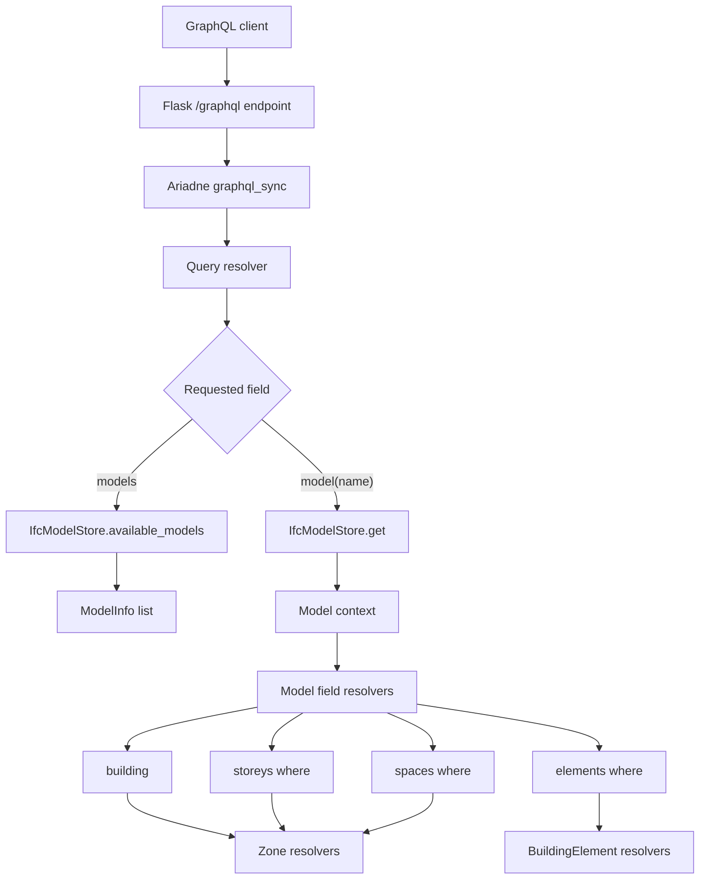
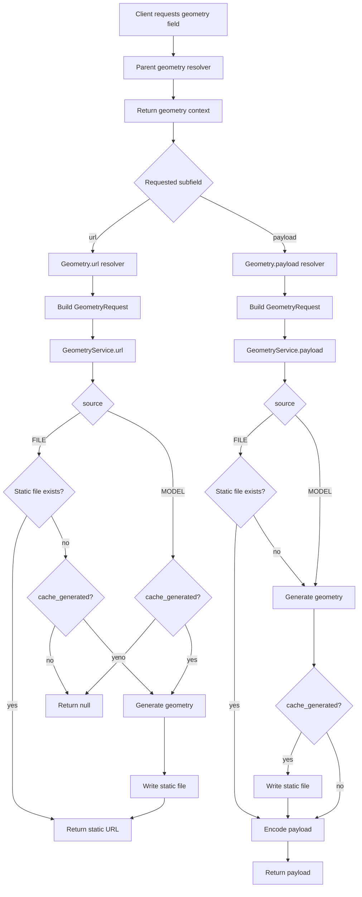
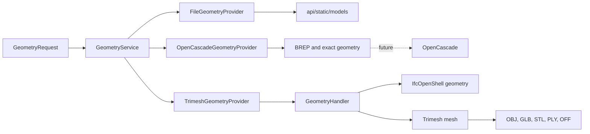
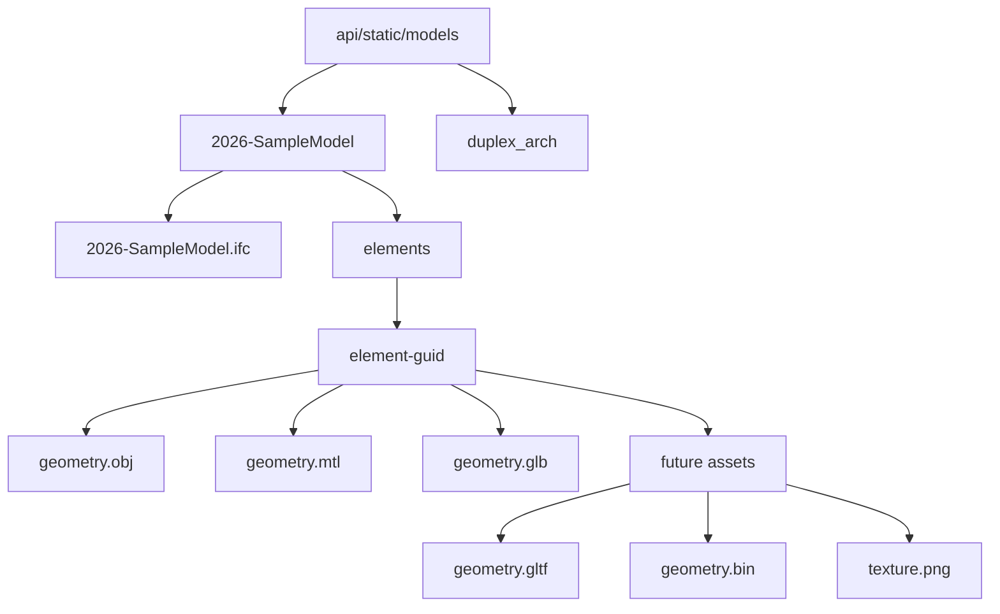

# Architecture Diagrams

## GraphQL Request Flow

```mermaid
flowchart TD
    Client[GraphQL client] --> Endpoint[Flask /graphql endpoint]
    Endpoint --> Ariadne[Ariadne graphql_sync]
    Ariadne --> Query[Query resolver]

    Query --> Models{Requested field}
    Models -- models --> Discover[IfcModelStore.available_models]
    Discover --> ModelInfo[ModelInfo list]

    Models -- model(name) --> Store[IfcModelStore.get]
    Store --> Context[Model context]
    Context --> ModelFields[Model field resolvers]

    ModelFields --> Building[building]
    ModelFields --> Storeys[storeys where]
    ModelFields --> Spaces[spaces where]
    ModelFields --> Elements[elements where]

    Building --> ZoneResolvers[Zone resolvers]
    Storeys --> ZoneResolvers
    Spaces --> ZoneResolvers
    Elements --> ElementResolvers[BuildingElement resolvers]
```

## Geometry Resolution Flow

```mermaid
flowchart TD
    Query[Client requests geometry field] --> Parent[Parent geometry resolver]
    Parent --> Context[Return geometry context]
    Context --> Field{Requested subfield}

    Field -- url --> UrlResolver[Geometry.url resolver]
    Field -- payload --> PayloadResolver[Geometry.payload resolver]

    UrlResolver --> UrlRequest[Build GeometryRequest]
    PayloadResolver --> PayloadRequest[Build GeometryRequest]

    UrlRequest --> UrlService[GeometryService.url]
    PayloadRequest --> PayloadService[GeometryService.payload]

    UrlService --> UrlSource{source}
    UrlSource -- FILE --> FileExists{Static file exists?}
    FileExists -- yes --> ReturnUrl[Return static URL]
    FileExists -- no --> UrlCache{cache_generated?}
    UrlCache -- no --> NullUrl[Return null]
    UrlCache -- yes --> GenerateForUrl[Generate geometry]
    GenerateForUrl --> WriteUrl[Write static file]
    WriteUrl --> ReturnUrl

    UrlSource -- MODEL --> ModelUrlCache{cache_generated?}
    ModelUrlCache -- no --> NullUrl
    ModelUrlCache -- yes --> GenerateForUrl

    PayloadService --> PayloadSource{source}
    PayloadSource -- FILE --> ReadFile{Static file exists?}
    ReadFile -- yes --> Encode[Encode payload]
    ReadFile -- no --> GeneratePayload[Generate geometry]
    PayloadSource -- MODEL --> GeneratePayload
    GeneratePayload --> PayloadCache{cache_generated?}
    PayloadCache -- yes --> WritePayload[Write static file]
    PayloadCache -- no --> Encode
    WritePayload --> Encode
    Encode --> ReturnPayload[Return payload]
```

## Geometry Providers

```mermaid
flowchart LR
    Request[GeometryRequest] --> Service[GeometryService]

    Service --> FileProvider[FileGeometryProvider]
    Service --> OCCProvider[OpenCascadeGeometryProvider]
    Service --> TrimeshProvider[TrimeshGeometryProvider]

    FileProvider --> StaticFiles[api/static/models]

    OCCProvider --> BREP[BREP and exact geometry]
    BREP -. future .-> OpenCascade[OpenCascade]

    TrimeshProvider --> Handler[GeometryHandler]
    Handler --> IfcOpenShell[IfcOpenShell geometry]
    Handler --> Trimesh[Trimesh mesh]
    Trimesh --> MeshFormats[OBJ, GLB, STL, PLY, OFF]
```

## Static Model Folder Layout

```mermaid
flowchart TD
    Root[api/static/models] --> ModelA[2026-SampleModel]
    Root --> ModelB[duplex_arch]

    ModelA --> IfcA[2026-SampleModel.ifc]
    ModelA --> ElementsA[elements]

    ElementsA --> ElementFolder[element-guid]
    ElementFolder --> Obj[geometry.obj]
    ElementFolder --> Mtl[geometry.mtl]
    ElementFolder --> Glb[geometry.glb]
    ElementFolder --> Future[future assets]

    Future --> Gltf[geometry.gltf]
    Future --> Bin[geometry.bin]
    Future --> Texture[texture.png]
```
